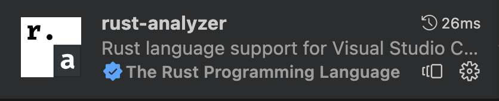

# Rust Handbook

## Rust Setup

#### Installation

**@reference** [Install Rust - Rust Programming Language (rust-lang.org)](https://www.rust-lang.org/tools/install)

1. MacOS/Linux/Unix-like OS
`curl --proto '=https' --tlsv1.2 -sSf https://sh.rustup.rs | sh`

2. Windows
`@see [url](https://forge.rust-lang.org/infra/other-installation-methods.html)`

#### Project Init

```shell
cargo new <project_name>
cd <project_name>
```

#### Rust In VSCode



-----


## Cargo Handbook Module

### 1. Cargo commands

#### 1.1 Project initialization

`cargo new <project_name>`

#### 1.2 Complie & Run Project

First execute `cargo build` then execute `./target/debug/<project_name>` to run the binary crate.

#### 1.3 Run Project

`cargo run` equals to `cargo build` + `./target/debug/<project_name>`

#### 1.4 Add dependency

`cargo add <dependency_name>@<dependency_version>`

------


## Hello World

``` rust
fn main() {
    println!("Hello, world!");
}
```


#### hello, Ferris

``` rust
use ferris_says::say;
use std::io::{stdout, BufWriter};

pub fn hello_from_ferris() {
  let stdout = stdout();
  let message = String::from("Hello, I am ferris");
  let width = message.chars().count();

  let mut writer = BufWriter::new(stdout.lock());
  say(&message, width, &mut writer).unwrap();
}
```

------


## Standard Library

### 基础语法

#### 变量

Rust是强类型语言, 但具有自动判断变量类型的能力.

如果需要声明变量, 需要使用`let`关键字. 例如:`let a = 1949;`

在这句声明语句之后, 以下三行代码都是禁止的:

``` rust
a = "hello";
a = 1949.10;
a = 1999;
```

- **第一行的错误**: 当声明a是1949之后, a就被确定为整数数字, 不能把字符串类型的值赋值给它
- **第二行的错误**: 自动转换数字精度有损失, Rust语言不允许精度有损失的自动数据类型转换
- **第三行的错误**: a不是可变变量

##### 什么是可变变量?

Rust是为了高并发安全而做的设计: 在语言层面尽量少的让变量的值可以改变. 所以a的值不可变. 但不意味着a不是`variable`, 官方文档称a这种变量为`不可变变量`;

如何使变量变成“可变”(mutable)只需要一个`mut`关键字

``` rust
let mut a = 100;
a = 200;
```


#### 常量和不可变变量的区别

既然不可变变量是不可变的, 那不就是常量吗? 为什么叫常量?

变量和常量还是有区别的. 在Rust中, 以下程序是合法的:

``` rust
let a = 100; // 可以编译
let a = 200;
```

但是如果a是常量就不合法了:

``` rust
const a = 100;
let a = 200;
```

变量的值是可以进行`shadowing`, 但在`shadowing`之前不能私自被改变, 这样可以确保每一次“绑定”之后的区域里编译器可以充分的推理程序逻辑. 

虽然Rust有自动判断类型的功能, 但有些情况下声明类型更加方便:

`let a:u64 = 123;`

这里声明了a为无符号64位整型变量, 如果没有声明类型, a将自动判断为有符号32位整型变量, 这对于a的取值范围有很大的影响.


#### Shadowing

**Shadowing**的概念的其他OOP语言的override和overload是不一样的.

**Shadowing**是指变量的名称可以被重新使用的机制:

``` rust
fn main() {
  let x = 5;
  let x = x + 1;
  let x = x * 2;
  println!("{}", x);
  // Will Output: 12
}
```

##### shadowing和mutable variable

shadowing和mutable variable的赋值不是一个概念, shadowing是指用同一个名字重新代表另外一个变量实体, 其类型、可变属性和值都可以变化. 但是mutable variable赋值仅能发生值的变化.

``` rust
fn main() {
  let x = 5;
  let x = "jater"; // work
  
  let mut y = 5;
  y = "hello"; // fail
  // Error: 
  // mismatched types expected integer, found `&str`
}
```

改变值

``` rust
pub fn main() {
  let y = 10;
  let y = 20;
}
```

改变类型

``` rust
pub fn main() {
  let y = 0;
  let y = "Jater Chu";
}
```

改变可变属性

``` rust
pub fn main() {
  let y = 10;
  let mut y = "Jater";
  y = "Jater Chu";
  let y = false;
}
```


##### Shadowing和scope

Variable bindings have a scope, and are constrained to live in a *block*. A block is a collection of statements enclosed by braces `{}`.

``` rust
fn main() {
  let long_lived = 1;
  {
    let short_lived = 2;
    // Will Output: short_lived 2
    println!("short_lived {}", short_lived);
  }
  // Error! `short_lived` doesn't exist in this scope.
  println!("short_lived {}", short_lived);
  
  // Will Output: long_live 1
  println!("long_lived {}", long_lived);
}
```

Also, variable shadowing is allowed.

``` rust
fn main() {
  let shadowing_binding = 1949;
  {
    println!("shadowing_binding-1 {}", shadowing_binding); // Will Output: shadowing_binding-1 1949
    let shadowing_binding = "Jater Chu";
    println!("shadowing_binding-2 {}", shadowing_binding); // Will Output: shadowing_binding-2 Jater Chu
  }
  println!("shadowing_binding-3 {}", shadowing_binding); // Will Output: shadowing_binding-3 1949

  let shadowing_binding = 1999;
  println!("shadowing_binding-4 {}", shadowing_binding); // Will Output: shadowing_binding-1 1999
}
```

